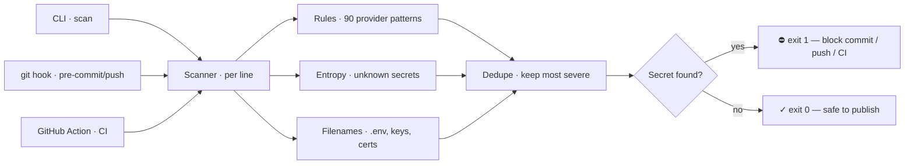

# Architecture

How leakguard is built, how a scan flows, and the reasoning behind the choices.

## The pipeline

The same scanner runs from three entry points, so a secret is stopped at the
earliest one that fires — ideally the local commit, before it ever reaches a
remote where the only safe fix is rotation.

1. **Source selection.** Three modes feed the same scanner:
   - `scan <path>` walks the tree (`lib/walk.ts`), skipping VCS/dependency/build
     dirs, binaries, lockfiles, minified files, and anything over 2 MB.
   - `scan --staged` reads the _staged blob_ of each staged file (`git show :file`)
     so a commit is judged on exactly what it will publish.
   - `scan --diff <range>` reads files changed in a commit range.
2. **Per-line detection** (`scanner.ts`). For each line:
   - **Allowlist short-circuit** — lines marked `leakguard:allow` are skipped.
   - **Rule regexes** — 90 provider/format patterns (`rules.ts`).
   - **Entropy** — high-Shannon-entropy tokens the rules don't know about,
     unless the line is inside a PEM block or carries hash/integrity/public-key
     context.
3. **Filename rules** flag sensitive files by name (`.env`, `id_rsa`, `*.pem`, …).
4. **Dedupe** collapses multiple rules matching the same span, keeping the most
   severe.
5. **Report** prints findings (pretty or `--json`), redacted by default, and the
   process exits `1` if anything was found.

## Detection layers, and why all three

No single technique is sufficient:

- **Rules** are precise and low-noise but only catch _known_ formats. 90 of them
  cover the common providers, each anchored to a distinctive prefix/structure.
- **Entropy** is the safety net for _unknown_ or custom secrets (a random 40-char
  token with no recognizable prefix). It's inherently noisier, so it's medium
  severity and heavily guarded (below).
- **Filename rules** catch the case where the _file itself_ is the secret — a
  committed `.env` or private key — independent of contents.

## Taming entropy false positives

High-entropy detection is the usual source of secret-scanner noise. leakguard
suppresses the common non-secrets that look random:

- **Hashes** — pure-hex strings of length 32/40/64 (md5 / git SHA / sha256) are
  skipped; hex needs a lower entropy bar than base64.
- **Character-class floor** — a base64 candidate must mix ≥3 classes, so
  identifiers and slugs don't trip.
- **Encoded text** — a base64 token that _decodes to mostly-printable text_ is
  data (a sentence, JSON), not a credential. Real keys decode to binary.
- **Context lines** — entropy is skipped on lines (and PEM blocks) carrying
  `integrity`, `sha512-`, `ssh-rsa`, `BEGIN PUBLIC KEY`, `data:…;base64,` markers.

Rules still run on all of these, so a real secret hiding on such a line is caught.

## How the ruleset was built (and why it's trustworthy)

The rules weren't hand-waved. They came from a structured design pass:

1. **Generate** a broad provider ruleset (prefix patterns + severities + samples).
2. **Adversarial corpus** — a separate effort produced real-looking secrets that
   must flag and tricky decoys that must not.
3. **Gap audit** — a reviewer ran every regex against every sample and reported
   defects: over-anchored exact lengths that would miss real tokens, an `openai`
   pattern broad enough to swallow `sk-or-`/`sk-ant-` keys, a generic rule that
   only matched _quoted_ values (missing `.env` assignments), and a multiline GCP
   rule that can't fire in a line scanner.
4. **Reconcile** — those defects were fixed, missing providers added, and the
   whole set re-checked: every rule now compiles, matches its own samples, and the
   corpus passes with **zero** false positives.

That loop — generate → attack → fix → verify — is why the rules can be trusted,
and it's encoded as tests (`test/examples.test.ts`, `test/corpus.test.ts`) that
run in CI.

## Suppression model

Three layers, escalating in scope:

| Layer    | File / marker                             | Use when                                       |
| -------- | ----------------------------------------- | ---------------------------------------------- |
| Inline   | `leakguard:allow` comment                 | one specific line is a known non-secret        |
| Path     | `.leakguardignore` (globs)                | a whole file/dir is fixtures or vendored       |
| Baseline | `.leakguard-baseline.json` (fingerprints) | accept existing findings, still catch new ones |

A finding's **fingerprint** is `sha256(file + ruleId + secret)` truncated — stable
across runs, so a baseline survives re-scans but a _new_ secret (new fingerprint)
still alerts.

## Why zero runtime dependencies

A tool you run on your secrets should have the smallest possible attack surface.
leakguard uses only the Node standard library (`fs`, `crypto`, `child_process`) —
nothing from npm at runtime — so there's no third-party code in the path of your
credentials and nothing to audit but this repo.

## Extending it

- **Add a rule:** append to `RULES` in `src/rules.ts` (`id`, `description`,
  `severity`, `regex`), and add a sample to `test/examples.ts`. The regression
  test enforces that it matches.
- **Tune entropy:** thresholds live in `src/types.ts` (`DEFAULT_SCAN_OPTIONS`);
  guards live in `src/lib/entropy.ts` and `src/scanner.ts`.
